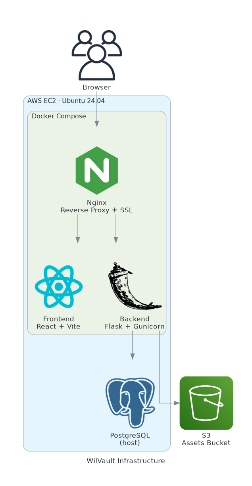

# WilVault

A personal finance dashboard for tracking accounts, transactions, and spending insights.

---

## Modules

### Dashboard

The home screen. Gives a high-level view of your financial health with net worth, total income, total expenses, and saving rate. Also shows a cash flow chart (income vs expenses over time), a spending breakdown by category (food, transport, health, etc.), and your last 5 transactions.

### Accounts

Manage one or more personal accounts, each behaving like a bank account or piggy bank. When creating an account you set the name, opening balance, and type — options are Checking, Savings, E-Wallet, Cash, Investment, or Credit Card. Each account's balance updates automatically as transactions are added.

### Transactions

Transactions belong to an account. Three types are supported: **income**, **expense**, and **transfer** (between your own accounts). Each transaction requires a title, amount, category, account, date, and an optional description.

---

## Tech Stack

| Layer | Technology |
|---|---|
| Frontend | React, Vite |
| Backend | Python 3.11, Flask, Gunicorn |
| Database | PostgreSQL |
| Reverse Proxy | Nginx |
| Containerization | Docker, Docker Compose |
| Hosting | AWS EC2 (Ubuntu 24.04) |
| Static Assets | AWS S3 |
| SSL | Let's Encrypt, Certbot |

---

## Infrastructure



In summary: the app runs on a single EC2 instance. Docker Compose manages three containers — Nginx, the React frontend, and the Flask backend. Nginx handles SSL termination and routes `/api/` traffic to the backend and everything else to the frontend. PostgreSQL is installed directly on the EC2 host and is reachable from the containers via the Docker bridge gateway. Static assets are stored in an S3 bucket.

---

## Project Structure

```
wilvault/
├── backend/
│   ├── Dockerfile
│   ├── requirements.txt
│   └── run.py
├── frontend/
│   ├── Dockerfile
│   └── nginx/
├── nginx/
│   └── nginx.conf
├── certbot/
├── docker-compose.yml
├── config.example.toml
├── config.toml
├── load_config.py
├── run-docker.sh
├── run-frontend-local.sh
├── run-backend-local.sh
└── infrastructure.html
```

---

## Getting Started

**Prerequisites:** Docker and Docker Compose installed on the host. PostgreSQL running on the host machine.

**1. Clone the repository**

```bash
git clone https://github.com/<your-username>/wilvault.git
cd wilvault
```

**2. Configure**

Copy the example config and fill in your values:

```bash
cp config.example.toml config.toml
```

Then generate the `.env` files for each service:

```bash
python load_config.py
```

**3. Run**

```bash
./run-docker.sh
# or
docker compose up -d
```

**4. Local development**

```bash
./run-frontend-local.sh
./run-backend-local.sh
```

---

## License

Personal use. No license applied.
